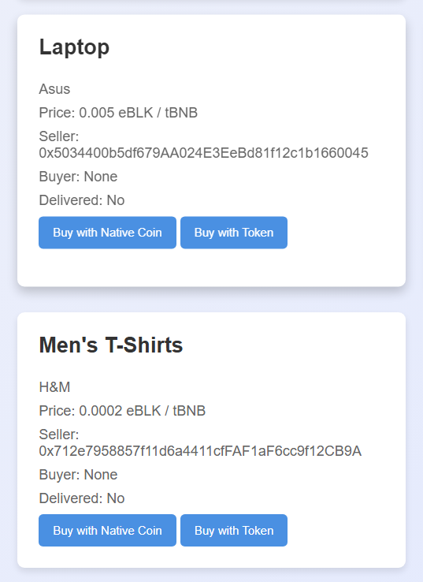
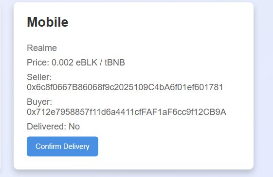

---

# 🛒 Decentralized-Marketplace  

Welcome to the **Decentralized E-Commerce Platform**! This project demonstrates a blockchain-powered marketplace for secure and transparent buying and selling of products using **tBNB** and the custom **eBLK Token**.  

---

## 🚀 About the Project  

This application allows sellers to list products and buyers to purchase them using native cryptocurrency (tBNB) or the **eBLK Token**. Payments are securely held in escrow until the buyer confirms delivery, ensuring trust for both parties. A 2% commission is automatically transferred to the platform owner upon delivery confirmation.  

---

## 📋 How to Test  

1. **Product Listing:**  
   - Sellers can list items by entering the product title, description, and price.  

2. **Buying a Product:**  
   - Buyers can choose a product, select a payment method (BNB or eBLK), and complete the purchase.  

3. **Confirm Delivery:**  
   - Buyers confirm delivery to release the funds to the seller and pay the commission to the platform owner.  

---

## 💡 Key Features  

- **Payment Options:** Supports transactions in tBNB and the custom **eBLK Token**.  
- **Escrow System:** Funds are held securely until the buyer confirms delivery.  
- **Commission System:** A 2% commission is automatically sent to the platform owner.  
- **User-Friendly Design:** Built with HTML, CSS, and JavaScript for seamless interaction.  
- **Transparency:** All transactions are secure and decentralized.  

---

## 🎨 Screenshots  

### Product Listing  
  

### Purchase Confirmation  
  

---

## ⚙️ Technologies Used  

- **HTML, CSS, JavaScript:** For the front-end user interface and interactions.  
- **Web3.js:** For blockchain interaction with smart contracts.  
- **Solidity:** For writing the smart contract (on the blockchain).  
- **Ethereum Blockchain:** For secure and decentralized transactions.  

---

## 📝 Smart Contract  
Explore the Solidity varified smart contract on [BNB Testnet](https://testnet.bscscan.com/address/0xD1a1bE8e4b6bDF91F0a339F19F6bD45cb6d4bC0e).  

---

## 🔒 Notes  

- Only the platform owner can manage system settings, like transferring ownership.  
- Payments are secure and processed only through the application's interface.  

---

Feel free to explore the code and try the application! 🚀  

--- 
